<h3><code>kashif@github ~ $ ./contributions.sh</code></h3>

  

<h3><code>kashif@github ~ $ whoami</code></h3>

<table>
<tr>
<td valign="top"></td>
<td valign="top"></td>
</tr>
</table>

  

<h3><code>kashif@github ~ $ ./about.sh</code></h3>

<b>Computer Science Student · Learning AI/ML · Motion Designer & Video Editor</b>

Building my way into tech through computer science, Python, data, AI/ML and practical projects. 
I also bring years of visual thinking from motion design and video editing.

  

Python · Java · NumPy · Pandas · OpenCV · FastAPI · Git · GitHub

