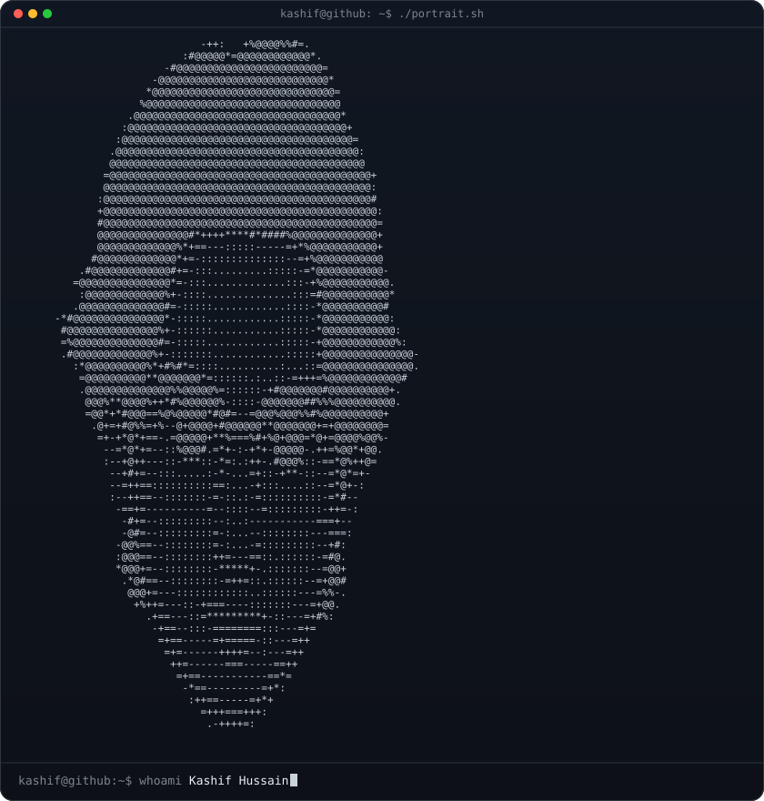

<div align="center">



<br>

### `kashif@github ~ $ whoami`

**Kashif Hussain**  
Computer Science Student · Learning AI/ML · Motion Designer & Video Editor

<sub>Building practical software while moving from a creative career into tech.</sub>

<br><br>

<a href="https://kashifhussa1n.framer.website/"></a>
<a href="https://github.com/kashifhussa1n"></a>

<br><br>

### `kashif@github ~ $ ./contributions.sh`


<br>

### `kashif@github ~ $ ./stats.sh`

<table>
<tr>
<td></td>
<td></td>
</tr>
</table>

<br>

### `kashif@github ~ $ cat stack.txt`


**NumPy · Pandas · OpenCV · FastAPI · SQLAlchemy**

<br>

### `kashif@github ~ $ cat now.txt`

```text
BS Computer Science
Learning → Python · Data · Machine Learning · Computer Vision
Building → practical projects that help me understand how real software works
Creative background → motion design · video editing
```

<sub>Motion design is where I started. Computer science is where I'm heading.</sub>

</div>
