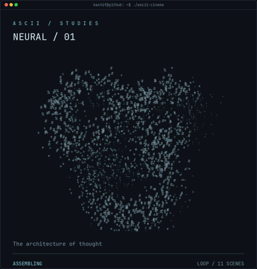

<h3><code>kashif@github ~ $ ./contributions.sh</code></h3>

 
 

<h3><code>kashif@github ~ $ whoami</code></h3>

<table>
<tr>
<td valign="top"><picture><source media="(prefers-reduced-motion: reduce)" srcset="./assets/cinema-poster.png" /></picture></td>
<td valign="top"></td>
</tr>
</table>

 
 

<h3><code>kashif@github ~ $ ./links.sh</code></h3>

<b>Computer Science Student · Learning AI/ML · Motion Designer &amp; Video Editor</b>

 
 

